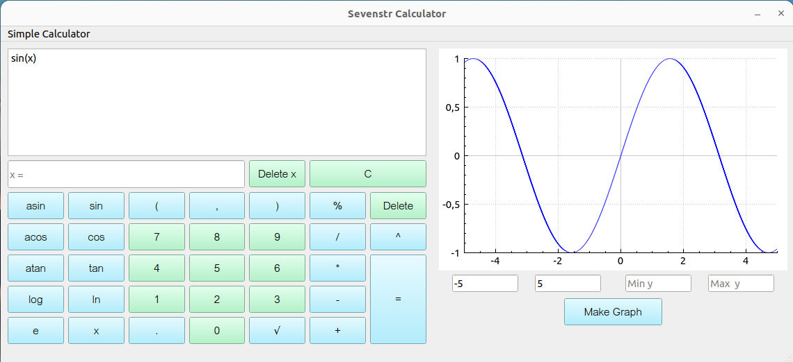

SmartCalculator implementation 

✔ C++17 standard

✔ MVC pattern

✔ Cmake, Makefile

✔ Google Style

✔ Unit tests by gtest

✔ Test coverage by GCOV

Calculator evaluates arbitrary arithmetic expressions in square brackets in infix notation. Moreover, program supports plotting a graph of a function given by an expression in infix notation.



Commands for installing and opening calculator:
```
cd src/
make install
make open
```


